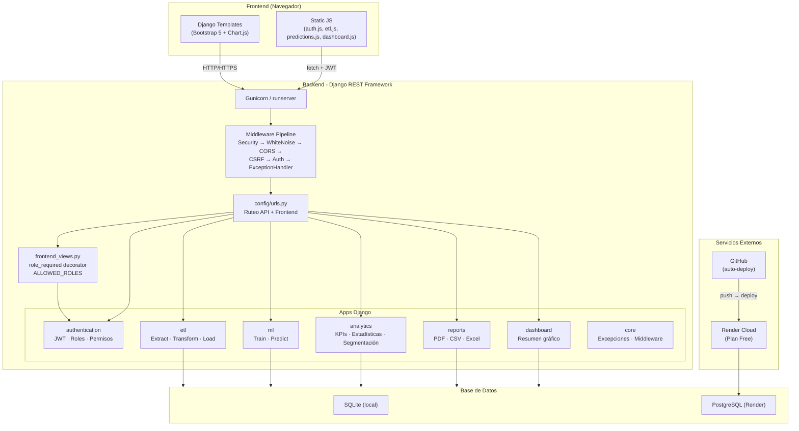
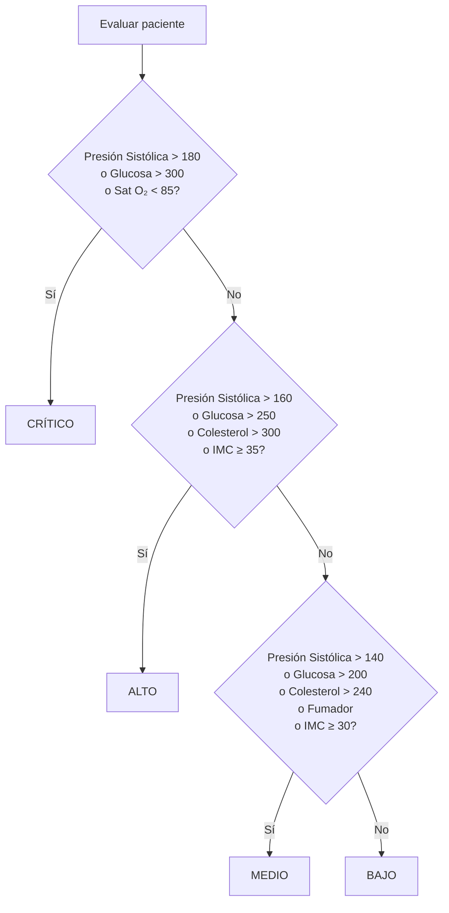
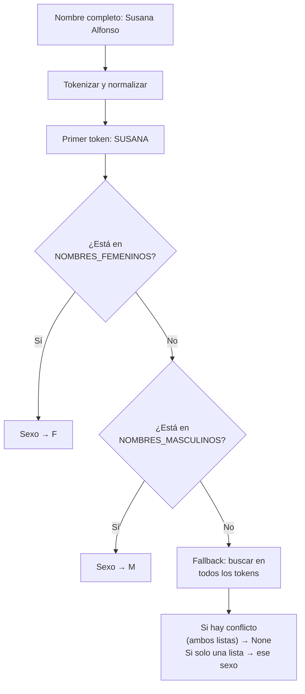
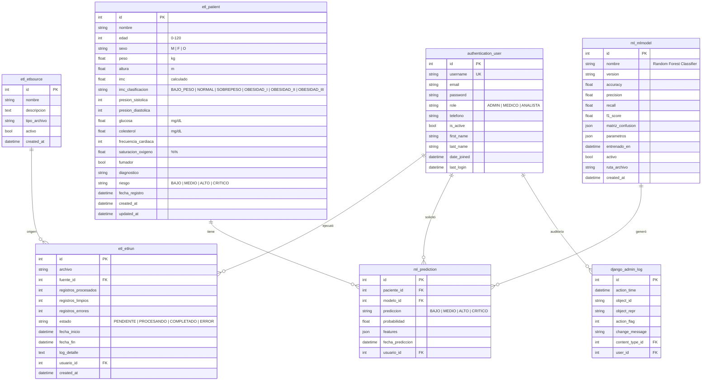
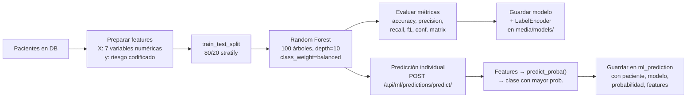

# Diagramas — Documentación Técnica

## 1. Arquitectura del Sistema



---

## 2. Flujo ETL

```mermaid
flowchart LR
    subgraph Input ["Entrada"]
        CSV["Archivo CSV"]
        XLSX["Archivo Excel<br/>(.xlsx / .xls)"]
    end

    subgraph Extract ["EXTRACT - DataExtractor"]
        DETECT["Detectar formato<br/>y codificación"]
        PARSE["Parsear con pandas<br/>(utf-8-sig / latin1)"]
        SNIFF["Sniff delimitador CSV"]
    end

    subgraph Transform ["TRANSFORM - DataTransformer"]
        NORM_COL["Normalizar columnas<br/>~80 variantes español/inglés"]
        MERGE["Concatenar nombre + apellido"]
        DEDUP["Eliminar duplicados<br/>(nombre + edad + sexo)"]
        CAST["Corregir tipos<br/>numéricos y booleanos"]
        SPELL["Limpiar errores<br/>ortográficos (sexo)"]
        IMPUTE["Imputar nulos<br/>con mediana"]
        CLIP["Validar rangos<br/>clínicos"]
        SEX["Corregir sexo<br/>por nombre<br/>(primer token)"]
        CALC_IMC["Calcular IMC<br/>peso / altura²"]
        CLASS_IMC["Clasificar IMC<br/>Bajo · Normal · Sobrepeso ·<br/>Obesidad I/II/III"]
        CLASS_RIESGO["Clasificar Riesgo<br/>BAJO · MEDIO · ALTO · CRITICO<br/>(según presión, glucosa,<br/>colesterol, IMC, fumador)"]
    end

    subgraph Load ["LOAD - DataLoader"]
        BATCH["Agrupar en lotes<br/>de 500 registros"]
        SAVEPOINT["Savepoint por lote<br/>(PostgreSQL safety)"]
        BULK["bulk_create()]
        UPDATE["Actualizar ETLRun<br/>registros_limpios / errores"]
    end

    subgraph Output ["Salida"]
        DB_OUT["Base de Datos<br/>Patient records"]
        HISTORY["Historial ETLRun<br/>Completado / Error"]
    end

    CSV --> DETECT
    XLSX --> DETECT
    DETECT --> PARSE
    PARSE --> SNIFF
    SNIFF --> NORM_COL
    NORM_COL --> MERGE
    MERGE --> DEDUP
    DEDUP --> CAST
    CAST --> SPELL
    SPELL --> IMPUTE
    IMPUTE --> CLIP
    CLIP --> SEX
    SEX --> CALC_IMC
    CALC_IMC --> CLASS_IMC
    CLASS_IMC --> CLASS_RIESGO
    CLASS_RIESGO --> BATCH
    BATCH --> SAVEPOINT
    SAVEPOINT --> BULK
    BULK --> UPDATE
    UPDATE --> DB_OUT
    UPDATE --> HISTORY
```

### Detalle de Clasificación de Riesgo



### Detalle de Corrección de Sexo por Nombre



---

## 3. Modelo Entidad-Relación (Base de Datos)



### Resumen de Tablas

| Tabla | Propósito | Registros típicos |
|---|---|---|
| `authentication_user` | Usuarios del sistema (admin, medico, analista) | 3–10 |
| `etl_patient` | Pacientes cargados vía ETL | miles |
| `etl_etlsource` | Fuentes de datos configuradas | 1–5 |
| `etl_etlrun` | Historial de ejecuciones ETL | decenas |
| `ml_mlmodel` | Modelos de ML entrenados | 1–5 |
| `ml_prediction` | Predicciones realizadas | cientos |

### Índices

```sql
-- etl_patient
INDEX (riesgo)       -- Filtro rápido por nivel de riesgo
INDEX (edad)         -- Segmentación etaria
INDEX (sexo)         -- Filtro por género
INDEX (imc)          -- Clasificación IMC
```

---

## 4. Machine Learning

### 4.1 Algoritmo

**Random Forest Classifier** con 100 árboles de decisión (`n_estimators=100`), profundidad máxima 10, `class_weight='balanced'` para manejar clases desbalanceadas.

**Hiperparámetros del modelo activo (v1.10):**
```python
{
    'bootstrap': True,
    'class_weight': 'balanced',
    'criterion': 'gini',
    'max_depth': 10,
    'max_features': 'sqrt',
    'min_samples_leaf': 2,
    'min_samples_split': 5,
    'n_estimators': 100,
    'random_state': 42,
    'n_jobs': -1,
}
```

### 4.2 Dataset de Entrenamiento

**Origen:** Pacientes cargados vía ETL desde archivos CSV/Excel.

| Métrica | Valor |
|---|---|
| Total pacientes en DB | **1,802** |
| Pacientes válidos para entrenamiento (con edad, IMC y riesgo) | **1,802** |
| Split entrenamiento/test | **80% / 20%** |
| Registros de entrenamiento | ~1,441 |
| Registros de test | ~361 |

**Distribución por riesgo en el dataset:**

| Riesgo | Cantidad | % |
|---|---|---|
| BAJO | 37 | ~2% |
| MEDIO | 263 | ~15% |
| ALTO | — | — |
| CRÍTICO | 1,045 | ~58% |

**Características (features) usadas para entrenamiento:**
| Feature | Tipo | Descripción |
|---|---|---|
| `edad` | numérico | Edad del paciente (0–120) |
| `imc` | numérico | Índice de Masa Corporal |
| `glucosa` | numérico | Glucosa en mg/dL |
| `colesterol` | numérico | Colesterol total en mg/dL |
| `presion_sistolica` | numérico | Presión arterial sistólica |
| `frecuencia_cardiaca` | numérico | Frecuencia cardíaca (latidos/min) |
| `fumador` | binario | 1 = fumador, 0 = no fumador |

**Variable objetivo (target):** `riesgo` → `BAJO`, `MEDIO`, `ALTO`, `CRITICO`

### 4.3 Métricas del Modelo (v1.10 — activo)

| Métrica | Valor |
|---|---|
| **Accuracy** | **74.24%** |
| **Precision** (weighted) | **78.02%** |
| **Recall** (weighted) | **74.24%** |
| **F1-Score** (weighted) | **74.56%** |

**Matriz de Confusión (test set — 361 registros):**

| Real \ Predicho | BAJO | MEDIO | ALTO | CRITICO |
|---|---|---|---|---|
| **BAJO** | **78** | 0 | 14 | 0 |
| **MEDIO** | 0 | **5** | 0 | 2 |
| **ALTO** | 46 | 1 | **140** | 22 |
| **CRITICO** | 4 | 0 | 4 | **45** |

**Interpretación:**
- **BAJO:** 78/92 correctos (84.8%), 14 confundidos con ALTO
- **MEDIO:** 5/7 correctos (71.4%), 2 confundidos con CRITICO
- **ALTO:** 140/209 correctos (67.0%), 46 confundidos con BAJO, 22 con CRITICO
- **CRITICO:** 45/53 correctos (84.9%), 4 confundidos con BAJO, 4 con ALTO

### 4.4 Codificador de Etiquetas (LabelEncoder)

El modelo guarda el `LabelEncoder` entrenado para mantener consistencia en las clases:

```python
classes_ = ['ALTO', 'BAJO', 'CRITICO', 'MEDIO']
# índice 0 → ALTO, 1 → BAJO, 2 → CRITICO, 3 → MEDIO
```

### 4.5 Predicciones Realizadas

| Total predicciones | 2 |
|---|---|
| Última predicción | ALTO (29.3% probabilidad) |

### 4.6 Pipeline de ML



### 4.7 API de Predicción

**Request** `POST /api/ml/predictions/predict/`:
```json
{
    "edad": 55,
    "imc": 31.2,
    "glucosa": 140,
    "colesterol": 220,
    "presion_sistolica": 150,
    "frecuencia_cardiaca": 85,
    "fumador": true
}
```

**Response:**
```json
{
    "prediccion": "ALTO",
    "probabilidad": 0.87,
    "probabilidades": {
        "BAJO": 0.02,
        "MEDIO": 0.05,
        "ALTO": 0.87,
        "CRITICO": 0.06
    },
    "id": 3
}
```

### 4.8 Historial de Versiones del Modelo

| Versión | Accuracy | F1-Score | Fecha |
|---|---|---|---|
| v1.0 | 66.67% | 65.56% | — |
| v1.1 | 66.67% | 65.56% | — |
| v1.2 | 66.67% | 65.56% | — |
| v1.3 | 66.67% | 65.56% | — |
| v1.4 | 66.67% | 65.56% | — |
| v1.5 | 66.67% | 65.56% | — |
| v1.6 | 69.92% | 70.03% | — |
| v1.7 | 69.92% | 70.03% | — |
| v1.8 | **74.24%** | **74.56%** | — |
| v1.9 | **74.24%** | **74.56%** | — |
| **v1.10 (activo)** | **74.24%** | **74.56%** | — |

---

*Generado desde el código fuente del proyecto.*

*Última actualización: Junio 2026*
